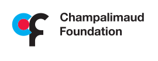
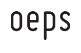
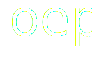
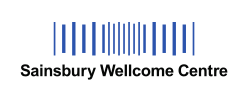
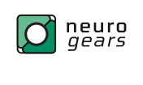
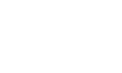
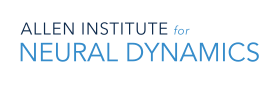
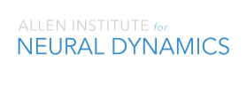

# About

The Harp project exists to provide interoperability standards and tools for accelerating open collaboration, innovation, and discovery in instrumentation for brain and behavior research. Harp was created by a group of scientists and engineers at the Champalimaud Foundation sharing a vision of the critical importance of standardization in neuroscientific experimentation. The Harp core team has since expanded to include members of the Open Ephys Production Site, the Sainsbury Wellcome Centre, NeuroGEARS, and the Allen Institute for Neural Dynamics.

We have all been frustrated by the lack of interoperability in neuroscience rigs and the difficulties of correlating data across different instruments, and are united in the passion of working together on bold ideas capable of closing the gap between scientific instrumentation and reproducible data sharing. The solution requires integration of standards for hardware, synchronization, control software, data and metadata storage formats, and data access tools. We believe that by working together we can make far more rapid progress than we could ever achieve in isolation.

With our active commitment to work in the open and develop shared public infrastructure, we promote a sustainable culture of transparency and collaboration for the benefit of scientific research, facilitating the sharing of contributions between individuals and organisations who want to volunteer their work for community projects, and providing documentation and training for anyone who wants to adopt and contribute to the Harp project.

{.display-light}
{.display-dark}
{.display-light}
{.display-dark}
{.display-light}
{.display-dark}
{.display-light}
{.display-dark}
{.display-light}
{.display-dark}