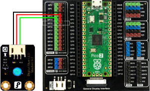

# Acquisition and Control

The exercises below will help you become familiar with acquiring and recording data from the [Harp Hobgoblin](https://github.com/harp-tech/device.hobgoblin), as well as issuing commands to connected peripheral devices using Bonsai. In addition, you will learn how to visualize and manipulate the recorded data in Python.

> [!WARNING]
> When adding the operators in these tutorials, make sure to use the high-level operators for your device (such as `Device (Harp.Hobgoblin)`) rather than the generic operators from the `Harp` package (such as `Device (Harp)`). This unlocks device-specific functionality.

## Acquisition

### Exercise 1: Acquiring analog input

In the acquisition section of this tutorial we will record data from a photodiode sensor. Connect the photodiode to analog input channel `0` (`GP26`) on the `Hobgoblin`. 

> [!TIP]
> You can use another sensor (such as a potentiometer, pushbutton, etc) and one of the other analog input channels by changing the appropriate properties.

{width=400px}

In Bonsai: 

:::workflow

:::

- Insert a [`Device`] operator. This type of operator is used to receive data from a Harp devices and send commands to it.
- Set the `PortName` property of the [`Device`] operator to the serial port `Hobgoblin` is connected to (e.g. `COM7`).
- Start the workflow. If you see the output of the [`Device`] operator you should observe a continuous stream of `HarpMessages`.

> [!NOTE]
> Notice how the [`Device`] operator automatically changes its name to `Hobgoblin` when added to the workflow. In this tutorial, we will be referring to the original name of the operator in the Bonsai `Toolbox`, which will be different from how it appears in your workflow or in the workflow images shown.

:::workflow

:::

- Insert a [`Parse`] operator.
- Within the [`Parse`] operator, select [`AnalogData`] from the `Register` property dropdown menu. 
- Right-click on the [`Parse`] operator, select `Harp.Hobgoblin.AnalogDataPayload` > `AnalogInput0` from the context menu. This will select data from the first analog input channel.

> [!NOTE]
> The `Harp` protocol is designed to be symmetrical. In other words, `Harp` devices send data, and receive commands, as `HarpMessages`. 
>
> - `Register`: Specifies which functionality we are manipulating. 
> - `Payload`: It is usually a way to refer to the data that is packed inside a given `HarpMessage`. Different `Registers` will have different `Payload` formats. Additionally, all `Payloads` contain a `Timestamp` that indicates when the data was acquired.
>
> A device-specific operator like [`Parse (Harp.Hobgoblin)`] is able to "recognize" that the `Register` [`AnalogData`] corresponds to data readouts from the `Hobgoblin` analog inputs and "understands" how to parse each [`AnalogDataPayload`] as the measurement from a single analog input channel. 

- Run the workflow, open the visualizer for `AnalogInput0`, and shine the flashlight from your phone on the photodiode. **What do you see?**

### Exercise 2: Acquiring timestamped data

One of the main advantages of devices in the Harp ecosystem is that all `HarpMessages` are hardware-timestamped, rather than relying on software timestamping by the operating system, which is susceptible to jitter. To access hardware timestamped data, make the follow modications to the previous workflow.

:::workflow

:::

- Delete the `AnalogInput0` node.
- Change the `Register` property in the [`Parse`] operator from [`AnalogData`] to [`TimestampedAnalogData`].
- Right-click on the [`Parse`] operator, select `Output (Bonsai.Harp.Timestamped<Harp.Hobgoblin.AnalogDataPayload>)` > `Seconds` from the context menu.
- Right-click on the [`Parse`] operator again, but this time select `Output (Bonsai.Harp.Timestamped<Harp.Hobgoblin.AnalogDataPayload>)` > `Value (Harp.Hobgoblin.AnalogDataPayload)` > `AnalogInput0` from the context menu.
- Add a [`Zip`] operator and connect the `Seconds` and `Value.AnalogInput0` nodes to it.
- Run the workflow and open the visualizers for the `Seconds`, `Value.AnalogInput0` and [`Zip`] nodes. **What is each visualizer representing?**

### Exercise 3: Recording timestamped data

For simple use cases, data can be saved to a text file using [`CsvWriter`]. In a later exercise, we will go through why this approach does not scale well for more complicated recordings. 

:::workflow

:::

- Delete the `Seconds` and [`Zip`] operator. We will keep `Value.AnalogInput0` for visualization.
- Add a [`CsvWriter`] operator in between the [`Parse`] operator and `Value.AnalogInput0`.
- Configure the `FileName` property of the [`CsvWriter`] with a file name ending in `.csv`, for instance `analog_input.csv`.
- Set the `IncludeHeader` property of the [`CsvWriter`] to `True`. This creates column headings for the text file.
- Run the workflow, shine the line on the photodiode, and then open the resulting text file. **How is the data organized?**

### Exercise 4: Visualizing recorded data

We will take a brief detour from Bonsai to look at how to visualize the data we have recorded. This section assumes you already have a python environment with [`pandas`](https://pandas.pydata.org/), [`matplotlib`](https://matplotlib.org/) and [`harp-python`](https://github.com/harp-tech/harp-python) installed.

```python
import pandas as pd

# Load the recorded data from the Bonsai workflow
df_analog_input = pd.read_csv("analog_input.csv", index_col = 0)

# Display the first few rows of the DataFrame
print(df_analog_input.head())

# Plot analog input channel 0
df_analog_input["Value.AnalogInput0"].plot(xlabel= "Timestamp (Seconds)", ylabel = "Analog Input (ADC value)")
```

## Control

### Exercise 5: Controlling digital output

In the control section of this tutorial, we will send commands to turn on and off a LED. Connect a LED to digital output channel `0` (`GP15`) on the `Hobgoblin`.

> [!TIP]
> You can use another actuator (such as an active buzzer) and one of the other digital output channels by changing the appropriate properties.

{width=400px}

Previously we have been acquiring data from the `Hobgoblin` by placing operators after the [`Device`] operator. In order to send commands to the device, we need to place operators that lead into the [`Device`] operator.

:::workflow

:::

- Insert a [`KeyDown`] operator and set its `Key` property to `A`. We will use this key to turn ON the LED.
- Insert a [`CreateMessage`] operator, which will construct a `HarpMessage` command to send to the device.
- Configure the `Payload` property to [`DigitalOutputSetPayload`] which will set the digital output to `High`.
- Configure the [`DigitalOutputSet`] property to select the digital output pin (`GP15`) to send the command to.

Now that we have constructed a `HarpMessage` to turn on the digital output, we will construct a similar `HarpMessage` to turn it off.

- Insert a [`KeyDown`] operator and set its `Key` property to `S`. We will use this key to turn OFF the LED.
- Insert a [`CreateMessage`] operator. 
- Configure the `Payload` property to [`DigitalOutputClearPayload`] which will clear the digital output and set it to `LOW`.
- Configure the [`DigitalOutputClear`] property to the same digital output pin (`GP15`).

> [!NOTE]
> At this point we are ready to send these `HarpMessage` commands into the `Hobgoblin`. However, the [`Device`] operator only accepts one input node transmitting all the `HarpMessage` commands.

- Insert a [`Merge`] operator to combine these two commands into one `HarpMessage` sequence.
- Insert a [`Device`] operator to send the `HarpMessage` sequence into the `Hobgoblin`.
- Run the workflow and press either the `A` or `S` key. **What do you observe?**

### Exercise 6: Recording timestamped commands

To know when the digital output of the `Hobgoblin` was turned on or off, we can use the same format we learned in the acquisition section to receive `HarpMessages` that are transmitted when the command was executed by device.

:::workflow

:::

- Insert a [`Parse`] operator and select [`TimestampedDigitalOutputSet`] from the `Register` property dropdown menu.
- Insert another [`Parse`] operator and select [`TimestampedDigitalOutputClear`] from the `Register` property dropdown menu.
- Run the workflow, open the visualizers for both of these nodes, and toggle the LED on and off. **What do you notice?**

> [!NOTE]
> For both operators, the `HarpMessage` contains the pin number for the digital output that was either turned on or off, as well as the timestamps for those commands. They can be used to report the digital output commands for all pins available on the `Hobgoblin`.

:::workflow

:::

- Log data from each register with a [`CsvWriter`] operator.
- Configure the `FileName` property of the [`CsvWriter`] with a file name ending in `.csv`, like `digital_output_set.csv`.
- Set the `IncludeHeader` property of the [`CsvWriter`] to `True`. 
- Run the workflow, toggle the LED on and off, and then open the resulting text file.

## Integration

### Exercise 7: Combining acquisition and control

You now have all the pieces to integrate for a full workflow that has both acquisition of data and control of peripheral devices. Combine the two workflows together and it should look something like this:

:::workflow

:::

As you can probably tell, it is quickly becoming unwieldy to manage so many connections to/from the [`Device`] operator. To help with this, we can use [subjects](https://bonsai-rx.org/docs/articles/subjects.html).

:::workflow

:::

- Disconnect the [`Parse`] operators that come after the [`Device`] operator.
- Add a [`PublishSubject`] operator. This node "broadcasts" all the events sent to it as a subject. Set the `Name` property to `Hobgoblin Events`.
- Add three [`SubscribeSubject`] operators and set the `Name` property. This node allows you to access `Hobgoblin Events` at any point in the workflow.
- Connect each [`SubscribeSubject`] to a [`Parse`] operator.
- Run the workflow and verify that you can record photosensitive signals on the analog input channel as well as toggle the LED with the keypresses.

### Exercise 8: Visualizing synchronized recordings

Another main advantage of devices in the Harp ecosystem is that all recorded information streams are timestamped to the same hardware clock. Thus, there is no need for post-hoc alignment during visualization and analysis. We will now take a look at our recorded text files and look at how to visualize them together. 

```python 
import pandas as pd
import matplotlib.pyplot as plt

# Load the data
df_analog_input = pd.read_csv("analog_input.csv", index_col = 0)
df_digital_output_set = pd.read_csv("digital_output_set.csv", index_col = 0)
df_digital_output_clear = pd.read_csv("digital_output_clear.csv", index_col = 0)

# Inspect the raw data
print(df_analog_input.head())
print(df_digital_output_set.head())
print(df_digital_output_clear.head())

# Label digital output, concat and sort
df_digital_output_set['DigitalOutput0'] = True
df_digital_output_clear['DigitalOutput0'] = False
df_digital_output = pd.concat([df_digital_output_set, df_digital_output_clear]).sort_index(kind='mergesort')

# Create a plot with the analog input channel 0
ax = df_analog_input["Value.AnalogInput0"].plot()

# Loop through digital events in pairs (`True` followed by `False`) and shade region
# Ignore duplicate commands
on_time = None
off_time = None
label_added = False
for _, row in df_digital_output.iterrows():
    if row['DigitalOutput0'] == True and on_time is None:
        on_time = row.name
    elif row['DigitalOutput0'] == False and on_time is not None:
        off_time = row.name
        ax.axvspan(on_time, off_time, color='lightblue', alpha=0.3, label='DigitalOutput0' if not label_added else None)
        # Reset variables
        label_added = True
        on_time = None  
        off_time = None

# Set plot properties
ax.set_xlabel("Timestamp (second)")
ax.set_ylabel("Analog Input (value)")
ax.legend()

# Show plot
plt.show()
```

## Data Interface

### Exercise 9: Streamlining recording

You might have noticed that the approach to recording data in [Exercise 7](#exercise-7-combining-acquisition-and-control) does not scale well, particularly when adding more `Registers` or additional devices. The `Harp.Hobgoblin` package provides a [`DeviceDataWriter`] operator that can be used to record all the data and commands received by the device. 

:::workflow

:::

- Copy the final workflow from [Exercise 7](#exercise-7-combining-acquisition-and-control).
- Delete all the existing [`CsvWriter`] branches.
- Subscribe to `Hobgoblin Events` using a [`SubscribeSubject`] operator. This will allow us to access all the `HarpMessages` that are being sent by the device.
- Add a [`DeviceDataWriter`] operator after the [`SubscribeSubject`] operator.
- Type a folder name in the `Path` property of [`DeviceDataWriter`]. This folder will be used to save all the data coming from the device.
- Run the workflow, then open the folder you specified in the previous step. **What do you observe?**

> [!NOTE]
> The [`DeviceDataWriter`] generates a `device.yml` file that contains device metadata that will be used later for loading data with `harp-python`. In addition, all the data from each `Register` is saved as a separate raw binary file. This includes not just data registers, but other common registers for device configuration or identification.

### Exercise 10: Streamlining data analysis

You might have also noticed that the approach to loading data in [Exercise 8](#exercise-8-visualizing-synchronized-recordings) does not scale well. The `harp-python` package also simplifies data visualization and analysis by providing a convenient interface to load and read the raw binary files that [`DeviceDataWriter`] records. This exercise assumes that you have setup the dependencies from previous exercises, as well as `harp-python`.

```python
import harp

# Create a `device` reader object to load `Hobgoblin` data
device = harp.create_reader("./data/device.yml")

# Read data from a register by doing device.<register_name>.read()
df_analog_data = device.AnalogData.read()

# The returned data is a `pandas.DataFrame` that can be easily inspected ...
print(df_analog_data.head())

# ...and visualized
df_analog_data.plot(xlabel= "Timestamp (seconds)", ylabel = "Analog Input (ADC value)")
```

> [!NOTE]
> **Optional** Now that you understand the data loaded by `harp-python`, can you reproduce [Exercise 8](#exercise-8-visualizing-synchronized-recordings)?

<!--Reference Style Links -->
[`AnalogData`]: xref:Harp.Hobgoblin.AnalogData
[`AnalogDataPayload`]: xref:Harp.Hobgoblin.AnalogDataPayload
[`CreateMessage`]: xref:Harp.Hobgoblin.CreateMessage
[`CsvWriter`]: xref:Bonsai.IO.CsvWriter
[`Device`]: xref:Harp.Hobgoblin.Device
[`DeviceDataWriter`]: xref:Harp.Hobgoblin.DeviceDataWriter
[`DigitalOutputSet`]: xref:Harp.Hobgoblin.DigitalOutputSet
[`DigitalOutputClear`]: xref:Harp.Hobgoblin.DigitalOutputClear
[`DigitalOutputClearPayload`]: xref:Harp.Hobgoblin.CreateDigitalOutputSetPayload
[`DigitalOutputSetPayload`]: xref:Harp.Hobgoblin.CreateDigitalOutputClearPayload
[`KeyDown`]: xref:Bonsai.Windows.Input.KeyDown
[`Merge`]: xref:Bonsai.Reactive.Merge
[`Parse`]: xref:Harp.Hobgoblin.Parse
[`Parse (Harp.Hobgoblin)`]: xref:Harp.Hobgoblin.Parse
[`PublishSubject`]: xref:Bonsai.Reactive.PublishSubject
[`SubscribeSubject`]: xref:Bonsai.Expressions.SubscribeSubject
[`TimestampedAnalogData`]: xref:Harp.Hobgoblin.TimestampedAnalogData
[`TimestampedDigitalOutputSet`]: xref:Harp.Hobgoblin.TimestampedDigitalOutputSet
[`TimestampedDigitalOutputClear`]: xref:Harp.Hobgoblin.TimestampedDigitalOutputClear
[`Zip`]: xref:Bonsai.Reactive.Zip