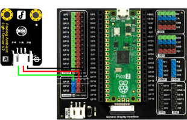

# Acquisition and Control

The exercises below will help you become familiar with acquiring and recording data from the [Harp Hobgoblin](https://github.com/harp-tech/device.hobgoblin), as well as issuing commands to connected peripherals using Bonsai. In addition, you will learn how to visualize and manipulate the recorded data in Python.

> [!WARNING]
> When adding the operators in these tutorials, make sure to use the device-specific operators, e.g. `Device (Harp.Hobgoblin)`.

## Prerequisites

- Install the [`Bonsai.Gui`](https://bonsai-rx.org/gui/) package from the [Bonsai package manager](https://bonsai-rx.org/docs/articles/packages.html).

## Acquisition

### Exercise 1: Acquiring analog input

In the acquisition section of this tutorial we will record data from a photodiode sensor. The photodiode sensor should be connected to analog input channel `0` (`GP26`) on the `Hobgoblin` as shown below.

> [!TIP]
> You can use another sensor (such as a potentiometer, push button, etc) and any of the other analog input channels (`GP27` or `GP28`). You may have to adjust properties accordingly.

{width=400px}

In Bonsai:

:::workflow

:::

- Insert a [`Device`] operator. This operator is used to receive data from Harp devices and send commands to it.
- Set the `PortName` property of the [`Device`] operator to the serial port `Hobgoblin` is connected to (e.g. `COM7`).
- Start the workflow. If you visualize the output of the [`Device`] operator you should observe a continuous stream of messages.

> [!NOTE]
> The [`Device`] operator automatically changes its name to `Hobgoblin` when added to the workflow. In this tutorial, we will be referring to the original name of the operator in the Bonsai toolbox, which will be different from how it appears in your workflow or in the workflow images shown.

:::workflow

:::

- Insert a [`Parse`] operator.
- Select the [`Parse`] operator, and pick [`AnalogData`] from the `Register` property dropdown menu. 
- Right-click on the [`Parse`] operator, select `Harp.Hobgoblin.AnalogDataPayload` > `AnalogInput0` from the context menu. This will select data from the first analog input channel.

> [!NOTE]
> Harp devices send data, and receive commands, encoded as [`HarpMessage`] objects following the [Harp binary protocol](../protocol/BinaryProtocol-8bit.md). The [`Parse`] operator is able to recognize and decode messages arriving from a specific `Register` (e.g. [`AnalogData`]) and recover the data encoded in the message payload (e.g. [`AnalogDataPayload`]).
> 
> All messages arriving from the device contain a hardware timestamp indicating when data was acquired, which can be recovered by selecting the `Timestamped` version of the register in the [`Parse`] operator, e.g. [`TimestampedAnalogData`].

- Run the workflow, open the visualizer for `AnalogInput0`, and shine the flashlight from your phone on the photodiode.  
**What do you see?**

### Exercise 2: Acquiring timestamped data

One of the main advantages of devices in the Harp ecosystem is that all [`HarpMessage`] data are hardware-timestamped, rather than relying on software timestamping by the operating system, which is susceptible to jitter. To access hardware timestamped data, make the follow modications to the previous workflow.

:::workflow

:::

- Change the `Register` property in the [`Parse`] operator from [`AnalogData`] to [`TimestampedAnalogData`].
- Replace the member selector at the end of the workflow with a [`RollingGraph`] operator.
- Select the [`RollingGraph`] operator, and set the `Index` property to use the `Seconds` field of the timestamped data.
- Set the `Value` property to the `Value` field of the timestamped data.
- Run the workflow and open the [`RollingGraph`] visualizer.  
**What is the visualizer representing?**

### Exercise 3: Recording timestamped data

For simple use cases, data can be saved to a text file using [`CsvWriter`]. In a later exercise, we will go through why this approach does not scale well for more complicated recordings.

:::workflow

:::

- Add a [`CsvWriter`] operator in between [`Parse`] and [`RollingGraph`].
- Configure the `FileName` property of the [`CsvWriter`] with a file name ending in `.csv`, for instance `AnalogData.csv`.
- Set the `IncludeHeader` property of the [`CsvWriter`] to `True`. This automatically creates column headings for the text file.
- Run the workflow, shine the light on the photodiode, and then open the resulting text file.  
**How is the data organized?**

> [!TIP]
> You can set the `Overwrite` property of the `CsvWriter` to `True` to avoid having to delete old files before each run. Be careful to disable this during actual experiment recordings!

### Exercise 4: Visualizing recorded data

We will take a brief detour from Bonsai to look at how to visualize the data we have recorded. This section assumes you already have a Python environment with [`pandas`](https://pandas.pydata.org/), [`matplotlib`](https://matplotlib.org/) and [`harp-python`](https://github.com/harp-tech/harp-python) installed. You can install these quickly with [`uv`](https://docs.astral.sh/uv/):

```cmd
uv pip install pandas matplotlib harp-python
```

The below script loads the CSV file and inspects the values in analog input 0.

```python
import pandas as pd

# Load recorded data from the CSV file
analog_data = pd.read_csv("./AnalogData.csv", index_col = 0)

# Display the first few rows of the DataFrame
print(analog_data.head())

# Plot analog input channel 0
analog_data["Value.AnalogInput0"].plot()
```

**How is the Harp timestamp getting into the X-axis?**

## Control

### Exercise 5: Controlling digital output

In the control section of this tutorial, we will send commands to turn on and off a LED. Connect one of the LED modules to digital output channel `GP15` on the `Hobgoblin`.

> [!TIP]
> You can use another actuator (such as an active buzzer) and any of the other digital output channels (`GP15` through `GP22`) by changing the appropriate properties.

{width=400px}

Previously we have been acquiring data from the `Hobgoblin` by placing operators after the [`Device`] operator. In order to send commands to the device, we need to place operators that lead into the [`Device`] operator.

:::workflow

:::

- Insert a [`KeyDown`] operator and set its `Key` property to `A`. We will use this key to turn ON the LED.
- Insert a [`CreateMessage`] operator, which will construct a [`HarpMessage`] command to send to the device.
- Configure the `Payload` property to [`DigitalOutputSetPayload`] which will set the digital output to `High`.
- Configure the [`DigitalOutputSet`] property to select the digital output pin (`GP15`) to send the command to.

Now that we have constructed a [`HarpMessage`] to turn on the digital output, we will construct a similar [`HarpMessage`] to turn it off.

- Insert a [`KeyDown`] operator and set its `Key` property to `S`. We will use this key to turn OFF the LED.
- Insert a [`CreateMessage`] operator. 
- Configure the `Payload` property to [`DigitalOutputClearPayload`] which will clear the digital output and set it to `LOW`.
- Configure the [`DigitalOutputClear`] property to the same digital output pin (`GP15`).

> [!NOTE]
> At this point we are ready to send these [`HarpMessage`] commands into the `Hobgoblin`. However, the [`Device`] operator only accepts a single input sequence transmitting all the [`HarpMessage`] commands.

- Insert a [`Merge`] operator to combine these two commands into one [`HarpMessage`] sequence.
- Insert a [`Device`] operator to send the [`HarpMessage`] sequence into the `Hobgoblin`.
- Run the workflow and press either the `A` or `S` key.  
**What do you observe?**

### Exercise 6: Recording timestamped commands

To know when the digital output of the `Hobgoblin` was turned ON or OFF, we can take advantage of the fact that every Harp device will always echo back any command sent to it with the hardware timestamp of when it was executed in the device. This means we can actually use the exact same format we learned in the acquisition section to receive the [`HarpMessage`] objects which are transmitted by the device when the command was executed.

:::workflow

:::

- Insert a [`Parse`] operator and select [`TimestampedDigitalOutputSet`] from the `Register` property dropdown menu.
- Insert another [`Parse`] operator as a branch, and select [`TimestampedDigitalOutputClear`] from the `Register` property dropdown menu.
- Run the workflow, open the visualizers for both of these nodes, and toggle the LED on and off.  
**What do you notice?**

> [!NOTE]
> For both operators, the [`HarpMessage`] contains the pin number for the digital output that was either turned ON or OFF, as well as the timestamps for those commands. They can be used to report the digital output commands for all pins available on the `Hobgoblin`.

:::workflow

:::

- Log data from each register with a [`CsvWriter`] operator.
- Configure the `FileName` property of the [`CsvWriter`] with a file name ending in `.csv`, e.g. `DigitalOutputSet.csv`.
- Set the `IncludeHeader` property of the [`CsvWriter`] to `True`.
- Run the workflow, toggle the LED on and off, and then open the resulting text files.

## Integration

### Exercise 7: Combining acquisition and control

You now have all the pieces to create a full workflow that has both acquisition of data and control of peripheral devices. Combine the two workflows together and it should look something like this:

:::workflow

:::

### Exercise 8: Visualizing synchronized recordings

Another main advantage of devices in the Harp ecosystem is that all recorded information streams are timestamped to the same hardware clock, even if they are not sampled with the same period. As such, there is no need for post-hoc alignment during visualization and analysis. We will now take a look at our recorded text files and look at how to visualize them together using Python.

```python 
import pandas as pd

# Load the data
analog_data = pd.read_csv("./AnalogData.csv", index_col = 0)
digital_output_set = pd.read_csv("./DigitalOutputSet.csv", index_col = 0)
digital_output_clear = pd.read_csv("./DigitalOutputClear.csv", index_col = 0)

# Inspect the raw data
print(analog_data.head())
print(digital_output_set.head())
print(digital_output_clear.head())

# Create a plot with all analog channels and vertical lines at digital events
ax = analog_data.plot()
adc_min, adc_max = (analog_data.min(axis=None), analog_data.max(axis=None))
ax.vlines(digital_output_set["Value"].index, adc_min, adc_max, colors='red', linestyles='dashed')
ax.vlines(digital_output_clear["Value"].index, adc_min, adc_max, colors='black', linestyles='dashed')
```

## Data Interface

### Exercise 9: Streamlining recording

You might have noticed that the approach to recording data in [Exercise 7](#exercise-7-combining-acquisition-and-control) does not scale well, particularly when adding more `Registers` or additional devices. The `Harp.Hobgoblin` package provides a [`DeviceDataWriter`] operator that can be used to record all the data and commands received by the device in a single standardized binary format.

:::workflow

:::

- Copy the final workflow from [Exercise 7](#exercise-7-combining-acquisition-and-control).
- Delete all the existing [`CsvWriter`] branches.
- Add a [`DeviceDataWriter`] operator after the [`Device`] operator.
- Type a name in the `Path` property of [`DeviceDataWriter`]. This name will be used to save all the data coming from the device into a folder with the same name.
- Run the workflow, then open the folder you specified in the previous step.  
**What do you observe?**

> [!NOTE]
> The [`DeviceDataWriter`] generates a `device.yml` file that contains device metadata that will be used later for loading data with `harp-python`. In addition, all the data from each `Register` is saved as a separate raw binary file. This includes not just data registers, but other common registers used for device configuration or identification.

### Exercise 10: Streamlining data analysis

You might also have noticed that the approach to loading data in [Exercise 8](#exercise-8-visualizing-synchronized-recordings) does not scale well as you have to juggle parsing and handling of all data files. The `harp-python` package also simplifies data visualization and analysis by providing a convenient interface to load and read the raw binary files that [`DeviceDataWriter`] records directly into a data frame.

This exercise assumes that you have setup the dependencies from previous exercises, as well as `harp-python`.

```python
import harp

# Create a device reader object to load Hobgoblin data
device = harp.create_reader("./Hobgoblin.harp")

# Read data from a register by doing device.<register_name>.read()
analog_data = device.AnalogData.read()

# The returned data is a pandas.DataFrame that can be easily inspected ...
print(analog_data.head())

# ...and visualized
analog_data.plot()
```

> [!NOTE]
> **Optional** Now that you understand the data loaded by `harp-python`, can you reproduce [Exercise 8](#exercise-8-visualizing-synchronized-recordings)?

<!--Reference Style Links -->
[`AnalogData`]: xref:Harp.Hobgoblin.AnalogData
[`AnalogDataPayload`]: xref:Harp.Hobgoblin.AnalogDataPayload
[`CreateMessage`]: xref:Harp.Hobgoblin.CreateMessage
[`CsvWriter`]: xref:Bonsai.IO.CsvWriter
[`Device`]: xref:Harp.Hobgoblin.Device
[`DeviceDataWriter`]: xref:Harp.Hobgoblin.DeviceDataWriter
[`DigitalOutputSet`]: xref:Harp.Hobgoblin.DigitalOutputSet
[`DigitalOutputClear`]: xref:Harp.Hobgoblin.DigitalOutputClear
[`DigitalOutputClearPayload`]: xref:Harp.Hobgoblin.CreateDigitalOutputSetPayload
[`DigitalOutputSetPayload`]: xref:Harp.Hobgoblin.CreateDigitalOutputClearPayload
[`HarpMessage`]: xref:Bonsai.Harp.HarpMessage
[`KeyDown`]: xref:Bonsai.Windows.Input.KeyDown
[`Merge`]: xref:Bonsai.Reactive.Merge
[`Parse`]: xref:Harp.Hobgoblin.Parse
[`Parse (Harp.Hobgoblin)`]: xref:Harp.Hobgoblin.Parse
[`PublishSubject`]: xref:Bonsai.Reactive.PublishSubject
[`RollingGraph`]: xref:Bonsai.Gui.ZedGraph.RollingGraphBuilder
[`SubscribeSubject`]: xref:Bonsai.Expressions.SubscribeSubject
[`TimestampedAnalogData`]: xref:Harp.Hobgoblin.TimestampedAnalogData
[`TimestampedDigitalOutputSet`]: xref:Harp.Hobgoblin.TimestampedDigitalOutputSet
[`TimestampedDigitalOutputClear`]: xref:Harp.Hobgoblin.TimestampedDigitalOutputClear
[`Zip`]: xref:Bonsai.Reactive.Zip