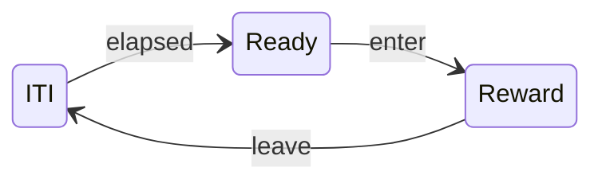

# Close-Loop Systems

The exercises below will help you become familiar with using the [Harp Hobgoblin](https://github.com/harp-tech/device.hobgoblin) device for close-loop experiments. You will also learn how to interface with external cameras. Before you begin, it is recommended that you review the Bonsai [Acquisition and Tracking](https://bonsai-rx.org/docs/tutorials/acquisition.html) tutorial, which covers key video concepts.

## Prerequisites

- Install the `Bonsai.Dsp`, `Bonsai.Video` and `Bonsai.Vision` packages from the [Bonsai package manager](https://bonsai-rx.org/docs/articles/packages.html).

## Close-loop latency
In a closed-loop experiment, we want the behaviour data to generate feedback in real-time into the external world, establishing a relationship where the output of the system depends on detected sensory input. Many behavioural experiments in neuroscience require some kind of closed-loop interaction between the subject and the experimental setup. 

One of the most important benchmarks to evaluate the performance of a closed-loop system is the latency, or the time it takes for a change in the output to be generated in response to a change in the input. The easiest way to measure the latency of a closed-loop system is to use a digital feedback test. 

Before beginning, set up the `Hobgoblin` with the following `device pattern` that we learned about in the previous tutorial.

:::workflow

:::

- Set the `DumpRegisters` property in the `Hobgoblin` [`Device`] operator to `False`. This is to avoid triggering the command loop in the next exercise.

### Exercise 1: Measuring serial port communication latency

We will take advantage of the device's ability to echo back a timestamped message upon command execution to create a simple loop where each echo re-triggers the same command (toggling the digital output channel `HIGH` and `LOW`). The time interval between the echoes will give us the total closed-loop latency of the system, also known as the round-trip time. 

:::workflow

:::

- Insert a [`SubscribeSubject`] operator and configure the `Name` property to `Hobgoblin Events`. 
- Insert a [`Parse`] operator and select [`TimestampedDigitalOutputTogglePayload`] from the `Register` property dropdown menu.
- Insert a [`CreateMessage`] operator, select [`DigitalOutputTogglePayload`] for the `Payload`, and `GP15` for the [`DigitalOutputToggle`] property.
- Insert a [`MulticastSubject`] operator and configure the `Name` property to `Hobgoblin Commands`. 

In order to measure the difference between the timestamps:

- Right-click on the [`Parse`] operator, select the `Output (Bonsai.Harp.Timestamped<Harp.Hobgoblin.DigitalOutputs>)` > `Seconds`.
- Disconnect the `Seconds` node from the [`CreateMessage`] operator.
- Reconnect the [`Parse`] and [`CreateMessage`] operator.
- After the `Seconds` node, insert a [`Difference`] operator.

Lastly, we will use this sequence to toggle the digital output and initialize the command loop:

- Insert a [`KeyDown`] operator and set the `Filter` property to the key `A`.
- Insert a [`Parse`] operator and select [`DigitalOutputTogglePayload`] from the `Register` property dropdown menu. Set the `DigitalOutputToggle` property to `GP15`
- Insert a [`MulticastSubject`] operator and configure the `Name` property to `Hobgoblin Commands`. 
- Run the workflow, and open the visualizer for the [`Difference`] operator.  
**What do you observe?**

### Exercise 2: Measuring video acquisition latency

{width=400px}
- Connect a red LED module to digital output channel `GP15` on the `Hobgoblin`.

:::workflow

:::

- Insert a [`VideoCaptureDevice`] operator. Set the `Index` property to the right camera.
- Insert a [`Crop`] transform.
- Run the workflow and set the `RegionOfInterest` property to a small area around the LED.

> [!Tip]
> You can use the visual editor for an easier calibration. While the workflow is running, right-click on the [`Crop`] transform and select `Show Default Editor` from the context menu or click in the small button with ellipsis that appears when you select the `RegionOfInterest` property.

- Insert a [`Sum`] transform and select the `Val2` field from the output.

> [!Note]
> The [`Sum`] operator adds the value of all the pixels in the image together, across all the color channels. Assuming the default BGR format, the result of summing all the pixels in the `Red` channel of the image will be stored in `Val2`. `Val0` and `Val1` would store the `Blue` and `Green` values, respectively. If you are using an LED with a color other than red, please select the output field accordingly.

- Insert a [`GreaterThan`] transform.
- Insert a [`BitwiseNot`] transform.
- Insert a [`CreateMessage`] operator, select [`DigitalOutputTogglePayload`] for the `Payload`, and `GP15` for the [`DigitalOutputToggle`] property.
- Insert a [`MulticastSubject`] operator and configure the `Name` property to `Hobgoblin Commands`. 
- Run the workflow and use the visualizer of the [`Sum`] operator to choose an appropriate threshold for [`GreaterThan`]. You can use the [`KeyDown`] toggle snippet from the previous exercise to manually toggle the LED.
- Insert a [`DistinctUntilChanged`] operator after the [`BitwiseNot`] transform.

> [!Note]
> The [`DistinctUntilChanged`] operator filters consecutive duplicate items from an observable sequence. In this case, we want to change the value of the LED only when the threshold output changes from `LOW` to `HIGH`, or vice-versa. This will let us measure correctly the latency between detecting a change in the input and measuring the response to that change.

In order to measure the round-trip time between the LED toggle:

:::workflow

:::

- Insert a [`SubscribeSubject`] operator and configure the `Name` property to `Hobgoblin Events`. 
- Insert a [`Parse`] operator and select [`TimestampedDigitalOutputTogglePayload`] from the `Register` property dropdown menu.
- Right-click on the [`Parse`] operator, select `Output (Bonsai.Harp.Timestamped<Harp.Hobgoblin.DigitalOutputs>)` > `Seconds` from the context menu.
- Insert a [`Difference`] operator.
- Run the workflow and open the visualizer for the [`Difference`] operator.

_Given the measurements obtained in Exercise 2, what would you estimate is the **input** latency for video acquisition?_

## Closed-Loop Control

### Exercise 3: Introduction to pulse trains

In neuroscience, pulse trains are commonly used to deliver precisely timed sequences of electrical states (`LOW` and `HIGH` - otherwise known as transistor-transitor-logic or `TTL`) to control external devices, such as cameras for synchronization or lasers for optogenetic stimulation. However, due to operating system limitations, generating pulse trains in software like Bonsai can be prone to timing jitter (though this approach is sufficient for the stimuli we have been working with). Fortunately the `Hogoblin` provides dedicated `Registers` that can be used to start or stop hardware-programmed pulse trains. 

:::workflow

:::

- Connect a LED module to digital output channel `GP15` on the `Hobgoblin`. 
- Insert a [`KeyDown`] operator and set the `Filter` property to the key `A`.
- Insert a [`Parse`] operator and select [`StartPulseTrainPayload`] from the `Register` property dropdown menu. Set the `DigitalOutput` property to `GP15`.
- Set the `PulseCount` property to `0`, `PulsePeriod` to `50000` and `PulseWidth` to `5000`. These parameters correspond to a continuous 20 Hz pulse train with 5 ms pulses.
- Insert a [`MulticastSubject`] operator and configure the `Name` property to `Hobgoblin Commands`. 
- Insert another [`KeyDown`] operator and set the `Filter` property to the key `S`.
- Insert a [`Parse`] operator and select [`StopPulseTrainPayload`] from the `Register` property dropdown menu. Set the `StopPulseTrain` property to `GP15`.
- Run the workflow, use the `A` and `S` keys to start and stop the pulse train.  
**What do you observe?**

To better understand what each parameter controls, try the following modifications. Reset the values to the parameters above after each step.

- Increase the `PulsePeriod` to `200000`. What is the frequency of this stimulation? How would you increase the frequency of the pulses to 40 Hz?
- Increase the `PulseWidth` to `40000`. What do you observe?
- How would you deliver a 2 second pulse train? (Hint: Use `PulseCount`)

>[!NOTE]
> **Optional** Verify the pulse train by connecting the output to a digital input pin.

>[!TIP]
> If your camera supports external triggering, you can use pulse trains to trigger frame capture. Recording the same pulse train on a digital input with the `Hobgoblin` allows you to have hardware timestamped images that are automatically aligned with other acquired data.

### Exercise 4: Triggering a digital line based on region of interest activity

:::workflow

:::

- Insert a [`VideoCaptureDevice`] operator. Set the `Index` property to the right camera.
- Insert a [`Crop`] transform.
- Run the workflow and set the `RegionOfInterest` property to specify the desired area.
- Insert a [`Grayscale`] and a [`Threshold`] transform (or the color segmentation operators).
- Insert a [`Sum`] transform, and select the `Val0` field from the output.
- Insert a [`GreaterThan`] transform and configure the `Value` property to an appropriate threshold. Remember you can use the visualizers to see what values are coming through the [`Sum`] and what the result of the [`GreaterThan`] operator is.
- Insert a [`CreateMessage`] operator, select [`DigitalOutputTogglePayload`] for the `Payload`, and `GP15` for the [`DigitalOutputToggle`] property.
- Insert a [`MulticastSubject`] operator and configure the `Name` property to `Hobgoblin Commands`. 
- Run the workflow and verify that entering the region of interest turns on the LED.
- **Optional:** Replace the [`Crop`] transform by a [`CropPolygon`] to allow for non-rectangular regions.
- **Optional:** Modify the workflow to replace the digital output toggle with a pulse train.

> [!Note]
> The [`CropPolygon`] operator uses the `Regions` property to define multiple, possibly non-rectangular regions. The visual editor is similar to [`Crop`], where you draw a rectangular box. However, in [`CropPolygon`] you can move the corners of the box by right-clicking _inside_ the box and dragging the cursor to the new position. You can add new points by double-clicking with the left mouse button, and delete points by double-clicking with the right mouse button. You can delete regions by pressing the `Del` key and cycle through selected regions by pressing the `Tab` key.

### Exercise 5: Conditioned place preference

Implement the following trial structure for conditioned place preference. `enter` and `leave` events should be triggered in real-time from the camera, by tracking an object moving in or out of a region of interest (ROI). `Reward` should be triggered once upon entering the ROI, and not repeat again until the object exits the ROI and the ITI has elapsed.

> [!Tip]
> There are several ways to implement ROI activation, so feel free to explore different ideas. Consider using either [`Crop`], [`RoiActivity`], or [`ContainsPoint`] as part of different strategies to implement the `enter` and `leave` events.

<!--Reference Style Links -->
[`BitwiseNot`]: xref:Bonsai.Expressions.BitwiseNotBuilder
[`ContainsPoint`]: xref:Bonsai.Vision.ContainsPoint
[`CreateMessage`]: xref:Harp.Hobgoblin.CreateMessage
[`Crop`]: xref:Bonsai.Vision.Crop
[`CropPolygon`]: xref:Bonsai.Vision.CropPolygon
[`Device`]: xref:Harp.Hobgoblin.Device
[`Difference`]: xref:Bonsai.Dsp.Difference
[`DigitalOutputToggle`]: xref:Harp.Hobgoblin.DigitalOutputToggle
[`DigitalOutputTogglePayload`]: xref:Harp.Hobgoblin.CreateDigitalOutputTogglePayload
[`DistinctUntilChanged`]: xref:Bonsai.Reactive.DistinctUntilChanged
[`DigitalOutputSet`]: xref:Harp.Hobgoblin.DigitalOutputSet
[`DigitalOutputClear`]: xref:Harp.Hobgoblin.DigitalOutputClear
[`DigitalOutputSetPayload`]: xref:Harp.Hobgoblin.CreateDigitalOutputClearPayload
[`GreaterThan`]: xref:Bonsai.Expressions.GreaterThanBuilder
[`Grayscale`]: xref:Bonsai.Vision.Grayscale
[`KeyDown`]: xref:Bonsai.Windows.Input.KeyDown
[`MulticastSubject`]: xref:Bonsai.Expressions.MulticastSubject
[`Parse`]: xref:Harp.Hobgoblin.Parse
[`RoiActivity`]: xref:Bonsai.Vision.RoiActivity
[`StartPulseTrainPayload`]: xref:Harp.Hobgoblin.CreateStartPulseTrainPayload
[`StopPulseTrainPayload`]: xref:Harp.Hobgoblin.CreateStopPulseTrainPayload
[`SubscribeSubject`]: xref:Bonsai.Expressions.SubscribeSubject
[`Sum`]: xref:Bonsai.Dsp.Sum
[`Threshold`]: xref:Bonsai.Vision.Threshold
[`TimestampedDigitalOutputTogglePayload`]: xref:Harp.Hobgoblin.TimestampedDigitalOutputToggle
[`VideoCaptureDevice`]: xref:Bonsai.Video.VideoCaptureDevice