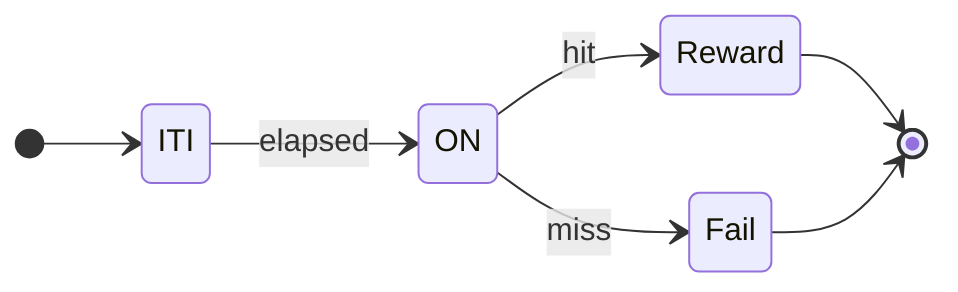
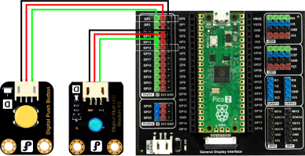

# Reaction Time Task

In this tutorial, you will learn how to use the [Harp Hobgoblin](https://github.com/harp-tech/device.hobgoblin) to implement a reaction time task which can be easily adapted and modified to model a wide range of systems neuroscience experiments.

When designing operant behaviour assays, it is useful to describe the task as a sequence of states the system goes through (e.g. stimulus on, stimulus off, reward, inter-trial interval, etc). Progression through these states is driven by events, which can be either internal or external to the system (e.g. button press, timeout, stimulus offset, movement onset). It is common to describe the interplay between states and events in the form of a finite-state machine diagram, or graph, where nodes are states, and arrows are events.

A reaction time task, where the subject needs to press a button as fast as possible following a stimulus, is described in the following diagram:



The task begins with an inter-trial interval (`ITI`), followed by stimulus presentation (`ON`). After stimulus onset, advancement to the next state can happen only when the subject presses the button (`success`) or a timeout elapses (`miss`). Depending on which event is triggered first, the task advances either to the `Reward` state, or `Fail` state. At the end, the task goes back to the beginning of the ITI state for the next trial.

### Exercise 1: Generating a fixed-interval stimulus

In this first exercise, you will assemble the basic hardware and software components required to implement the reaction time task. Connect the LED to digital output channel `GP15` on the `Hobgoblin`. Connect the push button to digital input channel `GP2` on the `Hobgoblin`. 

>[!TIP]
> You can use other digital input or digital output channels, but make sure to change the appropriate properties.

{width=520px}

Next, we will set up our `Hobgoblin`. 

:::workflow

:::

- Insert a [`Device`] operator and set the `PortName` property.
- Insert a [`DeviceDataWriter`] and set the `Path` property. Connecting it directly to the device ensures thats all events are logged.
- During this tutorial we will need to have the ability to send/receive commands from distinct places in the workflow. To allow this kind of "many-to-one"/"one-to-many" communication, we will:
- Insert a [`PublishSubject`] operator and name it `Hobgoblin Events`. This operator broadcasts events from the `Hobgoblin`, which you can receive at multiple points in the workflow using a [SubscribeSubject].
- Right-click the [`Device`] operator, select `Create Source (Bonsai.Harp.HarpMessage)` > [`BehaviorSubject`]. Name the generated ``BehaviourSubject`1`` operator `Hobgoblin Commands`. Connect it as input to the [`Device`] operator.

>[!NOTE]
> A [source subject](https://bonsai-rx.org/docs/articles/subjects.html#source-subjects) is an operator that is set up to receive commands from multiple places in the workflow and pass them on to the `Hobgoblin`. When choosing a type for the `source subject`, choosing a [`BehaviorSubject`] instead of a [`PublishSubject`] ensures that the connection remains open until the workflow is stopped.

> [!NOTE]
> We will use this `device pattern` when setting up our `Hobgoblin` for the rest of the tutorials.

Lastly, we will set up a fixed-interval blinking LED as our stimulus.

:::workflow

:::

- Insert a [`Timer`] source and set its `DueTime` property to 1 second.
- Insert a [`CreateMessage`] operator, configure the `Payload` property to [`DigitalOutputSetPayload`], and set the [`DigitalOutputSet`] property to the `GP15` pin.
- Insert a [`MulticastSubject`] operator and configure the `Name` property to `Hobgoblin Commands`. This operator forwards `HarpMessages` it receives to `Hobgoblin Commands`.
- Insert a [`Delay`] operator and set its `DueTime` property to 200 milliseconds.
- Insert a [`CreateMessage`] operator, configure the `Payload` property to [`DigitalOutputClearPayload`], and set the [`DigitalOutputClear`] property to the `GP15` pin.
- Insert a [`MulticastSubject`] operator and configure the `Name` property to `Hobgoblin Commands`.
- Insert a [`Repeat`] operator.
- Run the workflow, and verify that the LED is blinking.

### Exercise 2: Measuring reaction time

:::workflow

:::

- Insert a [`SubscribeSubject`] operator. Configure the `Name` property to `Hobgoblin Events`.
- Insert a [`Parse`] operator after `Hobgoblin Events`. Configure the `Register` property to [`TimestampedDigitalOutputSet`].
- Insert a [`SubscribeSubject`] operator. Configure the `Name` property to `Hobgoblin Events`.
- Insert a [`Parse`] operator after `Hobgoblin Events`. Configure the `Register` property to [`TimestampedDigitalInputState`].
- Run the workflow, verify that both the stimulus and the button are correctly recorded.

>[!TIP]
> We use separate `Hobgoblin Events` operators to avoid issues with [branching](https://bonsai-rx.org/docs/articles/subjects.html#branching-subjects). See also [workflow guidelines](https://bonsai-rx.org/docs/articles/workflow-guidelines.html)

### Exercise 3: Analyzing reaction time

We will take a brief detour from Bonsai to look at how to visualize the data we have recorded. This section assumes you already have a python environment with [`pandas`](https://pandas.pydata.org/), [`matplotlib`](https://matplotlib.org/) and [`harp-python`](https://github.com/harp-tech/harp-python) installed.

```python
# Import harp-python for data interface and pandas for simple plotting
import harp
import pandas as pd 

# Load device reader
device = harp.create_reader("./Hobgoblin.harp")

# Load digital input and digital output
digital_output_set = device.DigitalOutputSet.read()
digital_input_state = device.DigitalInputState.read()

# Inspect dataframe
print(digital_output_set.head())
print(digital_input_state.head())

# Discard_unused_channels
digital_output_set = digital_output_set["GP15"]
digital_input_state = digital_input_state["GP2"]

# Keep digital_input_state == True values (when button is pressed)
digital_input_state = digital_input_state[digital_input_state == True]

# Extract valid responses (first button press that occurs within response_window, our ITI is ~1.2 second)
response_window = 1.0
valid_response_times = []
for led_on in digital_output_set.index:
    for button_press in digital_input_state.index:
        response_time = button_press - led_on
        if 0 < response_time < response_window:
            valid_response_times.append(response_time)

# Calculate and print hit/miss percentage
num_valid_responses = len(valid_response_times)
num_total_trials = len(digital_output_set.index)
hit_percentage = num_valid_responses / num_total_trials * 100
print(f"There were {num_valid_responses} valid responses out of {num_total_trials} trials, giving a hit rate of {hit_percentage}%")

# Plot valid response times
pd.Series(valid_response_times).plot(kind="box", ylim=(0,1))
```

### Exercise 4: Driving state transitions with external behaviour events

In order to translate our simple reaction time task in the previous exercises into a proper state machine, we need to split up the fixed interval stimulus into different states. It is often convenient to consider the inter-trial interval period as the initial state, followed by stimulus presentation. 

:::workflow

:::

- Copy the workflows from [Exercise 1](#exercise-1-generating-a-fixed-interval-stimulus).
- Select the [`Timer`] operator and set its `DueTime` property to 3 second.
- Click and drag to select both the [`CreateMessage`] ([`DigitalOutputSetPayload`]) and `Hobgoblin Commands` operators.
- Right-click, select `Group` > `Sink (Reactive)`. Set the `Name` property to `StimOn`.
- Click and drag to select both the [`CreateMessage`] ([`DigitalOutputClearPayload`]) and `Hobgoblin Commands` operators.
- Right-click, select `Group` > `Sink (Reactive)`. Set the `Name` property to `StimOff`.

> [!Note]
> The [`Sink`] operator allows you to specify arbitrary processing side-effects without affecting the original flow of events. It is often used to trigger and control stimulus presentation in response to events in the task. Inside the nested specification, `Source1` represents input events arriving at the sink. In the specific case of `Sink` operators, the `WorkflowOutput` node can be safely ignored.

- Delete the [`Delay`] operator.
- Insert a [`SelectMany`] operator after `StimOn`, and set its `Name` property to `Response`.
- Double-click on the [`SelectMany`] node to open up its internal specification.

:::workflow

:::

- Delete the `Source1` operator.
- Insert a [`SubscribeSubject`] operator. Configure the `Name` property to `Hobgoblin Events`.
- Insert a [`Parse`] operator after `Hobgoblin Events`. Configure the `Register` property to [`DigitalInputState`].
- Insert a [`Condition`] operator after the [`Parse`] operator. 
- Double-click on the [`Condition`] operator and add an [`Equal`] operator after the `Source1` operator. Set the `Value` property to `GP2`.
- Insert a [`Take`] operator and set its `Count` property to 1.
- Connect the [`Take`] operator to `WorkflowOutput`.
- Run the workflow a couple of times and validate the state machine is responding to the button press.

> [!Note]
> [`DigitalInputState`] sends a [`HarpMessage`] when it detects a change on any of the digital input pins on the `Hobgoblin`. Using a [`Condition`]  with a nested [`Equal`] operator allows us to filter only messages from that pin. It also has the nice effect of only detecting a button press (when the value goes fron `None` > `GP2`) instead of a button release (`GP2`>`None`).

<!--Reference Style Links -->
<!-- [`AnalogData`]: xref:Harp.Hobgoblin.AnalogData -->
<!-- [`AnalogDataPayload`]: xref:Harp.Hobgoblin.AnalogDataPayload -->
[`BehaviorSubject`]: xref:Bonsai.Reactive.BehaviorSubject
[`Condition`]: xref:Bonsai.Reactive.Condition
[`CreateMessage`]: xref:Harp.Hobgoblin.CreateMessage
[`Delay`]: xref:Bonsai.Reactive.Delay
[`Device`]: xref:Harp.Hobgoblin.Device
[`DeviceDataWriter`]: xref:Harp.Hobgoblin.DeviceDataWriter
[`DigitalInputState`]: xref:Harp.Hobgoblin.DigitalInputState
[`DigitalOutputSet`]: xref:Harp.Hobgoblin.DigitalOutputSet
[`DigitalOutputClear`]: xref:Harp.Hobgoblin.DigitalOutputClear
[`DigitalOutputSetPayload`]: xref:Harp.Hobgoblin.CreateDigitalOutputSetPayload
[`DigitalOutputClearPayload`]: xref:Harp.Hobgoblin.CreateDigitalOutputClearPayload
[`Equal`]: xref:Bonsai.Expressions.EqualBuilder
[`HarpMessage`]: xref:Bonsai.Harp.HarpMessage
<!-- [`KeyDown`]: xref:Bonsai.Windows.Input.KeyDown -->
<!-- [`Merge`]: xref:Bonsai.Reactive.Merge -->
[`MulticastSubject`]: xref:Bonsai.Expressions.MulticastSubject
[`Parse`]: xref:Harp.Hobgoblin.Parse
[`PublishSubject`]: xref:Bonsai.Reactive.PublishSubject
[`SubscribeSubject`]: xref:Bonsai.Reactive.SubscribeSubject
[`Repeat`]: xref:Bonsai.Reactive.Repeat
[`SelectMany`]: xref:Bonsai.Reactive.SelectMany
[`Sink`]: xref:Bonsai.Reactive.Sink
[`SubscribeSubject`]: xref:Bonsai.Expressions.SubscribeSubject
[`Take`]: xref:Bonsai.Reactive.Take
[`Timer`]: xref:Bonsai.Reactive.Timer
<!-- [`TimestampedAnalogData`]: xref:Harp.Hobgoblin.TimestampedAnalogData -->
[`TimestampedDigitalOutputSet`]: xref:Harp.Hobgoblin.TimestampedDigitalOutputSet
[`TimestampedDigitalInputState`]: xref:Harp.Hobgoblin.TimestampedDigitalInputState
<!-- [`TimestampedDigitalOutputClear`]: xref:Harp.Hobgoblin.TimestampedDigitalOutputClear -->
<!-- [`Zip`]: xref:Bonsai.Reactive.Zip -->