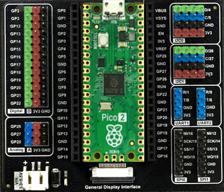

# Getting Started

The [Harp Hobgoblin](https://github.com/harp-tech/device.hobgoblin) is a simple multi-purpose device designed for learning the fundamentals of the Harp ecosystem. The principles demonstrated in this tutorial series can also be applied to other Harp devices.

{width=300}  
*<small>Pico2 board mounted on Gravity: Expansion Board</small>*

> [!NOTE]
> The `Hobgoblin` can be interfaced with a variety of input and output modules using the [Gravity: Expansion Board](https://www.dfrobot.com/product-2393.html). For more information on how to assemble the board, along with recommended sensor kits, refer to the resources in the [harp-tech/device.hobgoblin](https://github.com/harp-tech/device.hobgoblin) repository.

## Installation

- Install [Bonsai](https://bonsai-rx.org/docs/articles/installation.html).
- Install the `Harp.Hobgoblin` package by searching for it in the [Bonsai package manager](https://bonsai-rx.org/docs/articles/packages.html).

## Flashing the firmware

- Download the latest version of the [firmware](https://github.com/harp-tech/device.hobgoblin/releases/) that matches your Pico board.
- Press-and-hold the Pico `BOOTSEL` button while you connect the device to your computer's USB port. The Pico will be mounted as a new flash drive.
- Drag-and-drop the `.uf2` file into the drive.

## Testing the device

:::workflow

:::

- Connect a push button to analog input channel `0` (`GP26`) on the `Hobgoblin`.
- Set the `PortName` property of the [`Hobgoblin`](xref:Harp.Hobgoblin.Device) operator to the communications port of the `Hobgoblin` (e.g. COM7).
- Run the workflow and double-click the output of `AnalogInput0`. The value should change when the push button is pressed.

## Installing harp-python

The [harp-python](../articles/python.md) library provides a low-level interface to read and manipulate data from Harp devices. You can create a Python environment with `harp-python` using [`uv`](https://docs.astral.sh/uv/):

- Install [`uv`](https://docs.astral.sh/uv/).
- Create a new folder for the project.
- Navigate to the folder and initialize a new environment:

```cmd
uv venv
```

- Install `harp-python` as a dependency:

```cmd
uv pip install harp-python 
```